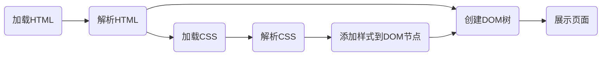

字节青训营学习笔记 - CSS

<!-- more -->

## CSS是什么

介绍:

CSS(Cascading Style Sheets)是一种用来定义HTML页面的样式的语言

通过其我们可以

* 设置字体和颜色

* 设置位置和大小

* 添加动画效果

* 为不同的设备适配不同的样式

## 使用CSS

```html
<!-- 外链 -->
<!-- 多个页面通用时使用 -->
<link rel="stylesheet" href="css/style.css">
<!-- 嵌入 -->
<!-- 单页面内多个元素通用时使用 -->
<style>
    body {
        background-color: #f5f5f5;
    }
</style>
<!-- 内联 -->
<!-- 单个元素设置特殊样式时使用 -->
<p style="color: #46A59A;">Hello World</p>
```

## 工作流程



## 选择器

三种方式

* 标签名、类名或ID

* 属性

* DOM树中的位置

还有一个特殊的选择器: `*` 统配选择器, 可以选择所有元素

选择器实例

```css

/* id选择器 */
#id {
    color: red;
}

/* 类名选择器 */
.class {
    color: blue;
}

/* 标签选择器 */
p {
    color: green;
}

/* 属性选择器 */
/* 匹配 <input disable/> */
[disabled] {
    background-color: #ccc;
}

input[disabled] {
    background-color: #ccc;
}

input[type="text"] {
    background-color: #ccc;
}

/* herf以#开头 */
a[href^="#"] {
    background-color: #ccc;
}

/* herf以.jpg结尾 */
a[href$=".jpg"] {
    background-color: #ccc;
}
```

## 伪类

当元素属于某个状态时, 可以使用伪类

```css
/* 默认状态 */
a:link{
    color: #46A59A;
}

/* 点击之后 */
a:visited {
    color: #46A59A;
}

/* 鼠标移入 */
a:hover{
    color: #46A59A;
}

/* 鼠标离开 */
a:active {
    background-color: #ccc;
}

/* 被选中 */
:focus {
    background-color: #ccc;
}

/* 结构伪类 */
/* 第一个子元素 */
:first-child {
    background-color: #ccc;
}

/* 最后一个 */
:last-child {
    background-color: #ccc;
}
```

## 组合(<font color="red">重点</font>)

|名称|语法|说明|实例|
|-----|-----|-----|-----|
|直接组合|AB|满足A同时也满足B|`input:focus`|
|后代组合|A B|选择A的子孙B|`div a`|
|亲子组合|A>B|选择A的子元素B|`div>a`|
|兄弟选择器|A~B|如果B在A后且同级则选择它|`a~img`|
|相邻选择器|A+B|如果B紧跟在A后则选择它|`a+img`|

当选择多个时, 通过 `,` 隔开, 称为选择器组

## 颜色

三原色

* R: red
* G: green
* B: blue

通过三色可以设置颜色, 数值从0-255

`#8fac87` 与 `rgb(143, 172, 135)` 为两种设置颜色的方法，前者为后者三色的值转为16进制后拼接

### HSL

通过三方面来区分颜色

* Hue: 色调 颜色(0-360)
* Saturation: 饱和度 越高越鲜艳(0-100)
* Lightness: 亮度 越高颜色越亮(0-100)

使用方式: `hsl(0, 100%, 50%)`

### 透明度

`rgba(255, 0, 0, 0.5)`: 透明度为50%的红色

`hsla(0, 100%, 50%, 0.6)`: 透明度为60%的红色

`#ff0000ff`: 透明度为255的红色

## 字体

```css

/* 字体族 */
body {
    /* 从前往后匹配直到遇到拥有的字体 */
    /* sans-serif 为通用字体 无衬线 一定要在最后加一个通用字体族*/
    font-family: "Helvetica Neue", Helvetica, Arial, sans-serif;

}
```

### 使用网络字体

```css
@font-face{
    font-family: "MyFont";
    src: url("http://example.com/font.woff");
}

body {
    font-family: "MyFont", sans-serif;
}
```

### 字体样式

大小:

`font-size`: `<font-size>` 字体大小

`font-size` 可以是一个数值加单位, 如 `px`, `em`, `rem`

样式:

`font-style`: `<font-style>` 字体样式

* `normal`: 正常
* `italic`: 斜体
* `oblique`: 倾斜
* `initial`: 初始值
* `inherit`: 继承

字重:

`font-weight`: `<font-weight>` 字体重量, 数值越大越粗

行高:

设置两行文字之间的间距

`line-height`: `<line-height>` 行高

组合设置:

```css
body {
    /* 斜体 粗细 大小/行高 字体族*/
    font: italic bold 1.5em/1.7 "Helvetica Neue", Helvetica, Arial, sans-serif;
}
```

对齐:

`text-align`: `<text-align>` 文字对齐

* `left`: 左对齐
* `right`: 右对齐
* `center`: 居中
* `justify`: 两端对齐
* `initial`: 初始值

间距:

`letter-spacing`: `<letter-spacing>` 字符间距

`word-spacing`: `<word-spacing>` 单词间距

首行缩进:

`text-indent`: `<text-indent>` 首行缩进

文字修饰:

`text-decoration`: `<text-decoration>` 文字修饰

* `none`: 无修饰
* `underline`: 下划线
* `overline`: 上划线
* `line-through`: 删除线
* `initial`: 初始值
* `inherit`: 继承

不可见字符处理:

`white-space`: `<white-space>` 不可见字符处理

* `normal`: 正常
* `nowrap`: 不换行
* `pre`: 单词首字母紧靠
* `pre-wrap`: 单词首字母紧靠, 其他字符换行
* `pre-line`: 单词首字母紧靠, 其他字符不换行
* `initial`: 初始值
* `inherit`: 继承
