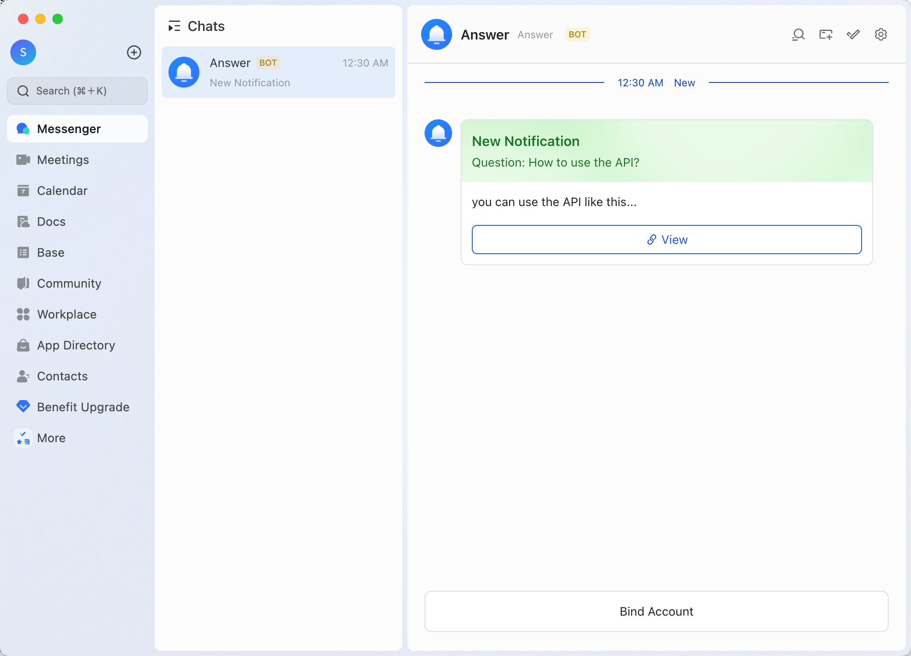
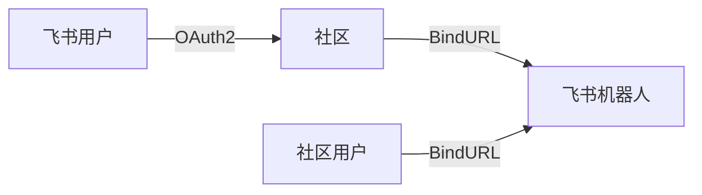
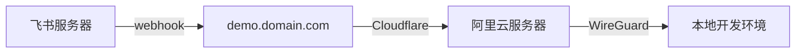

## 0x00 引言

在前两天的 Apache CommunityOverCode Asia 2024 大会上认识到了一个很有意思的项目：`Apache Answer`。这是一个 `Apache` 基金会下的开源问答社区系统，可以帮助开发者在社区中快速找到答案。尝试为这个项目做一些贡献，整理一下开发笔记。

领取的任务: [incubator-answer-plugins | Lark Notification Support #76](https://github.com/apache/incubator-answer-plugins/issues/76)

<!-- more -->

## 0x01 设计

社区通过创建一个飞书组织并在其中添加一个机器人，将机器人的 `Webhook` 地址配置到机器人中。当社区中有新的问题或回答时，插件会通过飞书机器人通知用户。

由于 `Answer` 插件机制的限制没有办法申请一个路由来接收飞书的消息回调实现对用户进行绑定，只能够实现接收通知事件方法，在方法中也只能获取到用户和系统的配置，其它的信息都无法获取。

因此设计了两个版本的插件，基础版需要用户自己创建一个飞书应用，通过应用反馈拿到自己的用户ID以后配置到插件中，扩展版则是另起一个 `Http Listen` 监听回调请求，网站管理员配置好以后用户只需要绑定自己的账户然后在用户设置中启用通知即可。

消息的形式上选择使用卡片消息



下面为完整版设计

绑定：



通知：


配置项需要数据

系统配置项

| 配置项 | 数据类型 | 描述 |
| --- | --- | --- |
| `飞书机器人 App ID` | `string` | 飞书机器人的 `Webhook` 地址 |
| `飞书机器人 App Secret` | `string` | 飞书机器人的 `Token` |

用户配置项
| 配置项 | 数据类型 | 描述 |
| --- | --- | --- |
| 飞书用户 ID | `string` | 飞书用户的 `OpenID` 只写 |
| 收件箱通知 | `bool` | 是否打开收件箱通知 |
| 新问题通知 | `bool` | 是否打开新问题通知 |
| 关注标签的新问题通知 | `bool` | 是否打开关注标签的新问题通知 |

权限列表

| 权限ID | 权限名称 | 描述 |
| --- | --- | --- |
| `im:message` | 获取与发送单聊、群组消息 | 获取与发送单聊、群组消息` |

对于基础版来说系统配置项下放至用户配置项中，用户配置项中的 `飞书用户 ID` 通过[如何获取自己的 Open ID？](https://open.feishu.cn/document/faq/trouble-shooting/how-to-obtain-openid#8100d875)来获取

由于机器人需要发送消息权限，为了避免审核还需要飞书管理员设置发送消息权限为免审核

> ⚠️ 注意，设置免审核权限后用户在创建应用发送消息时不再需要审核，可能会造成骚扰行为，请谨慎考虑。

## 0x02 账户绑定

先注册一个飞书机器人，这里不过多赘述，可以参考[官方文档](https://open.feishu.cn/document/client-docs/bot-v3/bot-overview)。由于飞书当前公开版本的 `OAuth2` 授权是非标导致无法使用仓库中已有的 [OAuth2 Basic](https://github.com/apache/incubator-answer-plugins/tree/main/connector-basic) 插件

> [飞书OAuth2 接口文档](https://open.feishu.cn/document/uAjLw4CM/ukTMukTMukTM/reference/authen-v1/oidc-access_token/create) 中可以看到编码方式不是 `application/x-www-form-urlencoded` 而是 `application/json`。

通过朋友了解到飞书已经在内测标准接口了，拿到内测接口测试了下可以登录，免去再开发个飞书登录插件的问题，工作量减减！！！

开发调试需要设置 `Webhook` 来向 `Answer` 插件发送消息，需要把开发环境暴露到公网上这里通过转发来实现。

整个开发环境访问链路如下



由于域名是解析到 Cloudflare 上的，所以阿里云服务器没办法通过 `acme.sh` 自动续签证书，所以只能手动设置证书，可以参考 `Cloudflare` 的 [加密CloudFlare 与您源服务器之间的流量](https://developers.cloudflare.com/ssl/origin-configuration/origin-ca/) 获取证书。阿里云服务器配置如下

```caddyfile
demo.domain.com {
    tls cert.pem cert.key
    reverse_proxy http://192.168.3.x:3000
}
```

`WireGuard` 在之前的文章中有过介绍可以参考下。

根据官方文档创建一个插件，需要注意开发时插件的包名需要在三个地方相同

```go
// cmd/answer/main.go
import (
    _ "github.com/apache/incubator-answer-plugins/notification-lark" // 引入插件
    answercmd "github.com/apache/incubator-answer/cmd"
)
```

```go
// ui/src/plugins/notification-lark/go.mod
module github.com/apache/incubator-answer-plugins/notification-lark
```

```go
// go.mod
replace github.com/apache/incubator-answer-plugins/notification-lark => ./ui/src/plugins/notification-lark
```
