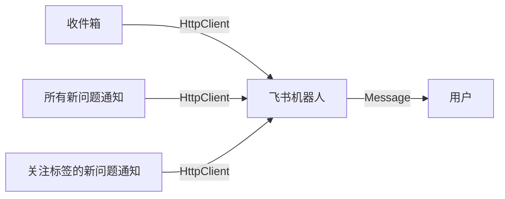

## 0x00 引言

`Answer` 是一个 `Apache` 基金会下的开源问答社区系统，可以帮助开发者在社区中快速找到答案。尝试为这个项目做一些贡献，整理一下开发笔记。

领取的任务: [incubator-answer-plugins | Lark Notification Support #76](https://github.com/apache/incubator-answer-plugins/issues/76)

<!-- more -->

## 0x01 设计

社区通过创建一个飞书组织并在其中添加一个机器人，将后端的 `Webhook` 地址配置到机器人中。当社区中有新的问题或回答时，插件会通过飞书机器人通知用户。

消息的形式上选择使用卡片消息


需要实现 `Notification` 接口

```go
type Notification interface {
    GetNewQuestionSubscribers() (userIDs []string)
    Notify(msg NotificationMessage)
}
```

绑定：


通知：



配置项需要数据

系统配置项

| 配置项       | 数据类型 | 描述                      |
| ------------ | -------- | ------------------------- |
| `App ID`     | `string` | 飞书机器人的 `App ID`     |
| `App Secret` | `string` | 飞书机器人的 `App Secret` |

用户配置项
| 配置项               | 数据类型 | 描述                         |
| -------------------- | -------- | ---------------------------- |
| 飞书用户 ID          | `string` | 飞书用户的 `OpenID`          |
| 收件箱通知           | `bool`   | 是否打开收件箱通知           |
| 新问题通知           | `bool`   | 是否打开新问题通知           |
| 关注标签的新问题通知 | `bool`   | 是否打开关注标签的新问题通知 |

权限列表

| 权限ID       | 权限名称                 | 描述                      |
| ------------ | ------------------------ | ------------------------- |
| `im:message.p2p_msg:readonly` | 读取用户发给机器人的单聊消息 | 可接收单聊中用户向机器人发送的消息。 |

事件列表
| 事件ID      | 事件名称                 | 描述                      |
| ------------ | ------------------------ | ------------------------- |
| `application.bot.menu_v6` | 机器人自定义菜单事件 | 接收用户点击按钮 |

## 0x02 插件创建

先注册一个飞书机器人，这里不过多赘述，可以参考[官方文档](https://open.feishu.cn/document/client-docs/bot-v3/bot-overview)。

根据官方文档创建一个插件，需要注意开发时插件的包名需要在三个地方相同

```go
// cmd/answer/main.go
import (
    _ "github.com/apache/incubator-answer-plugins/notification-lark" // 引入插件
    answercmd "github.com/apache/incubator-answer/cmd"
)
```

```go
// ui/src/plugins/notification-lark/go.mod
module github.com/apache/incubator-answer-plugins/notification-lark
```

```go
// go.mod
replace github.com/apache/incubator-answer-plugins/notification-lark => ./ui/src/plugins/notification-lark
```

## 0x03 接入飞书

