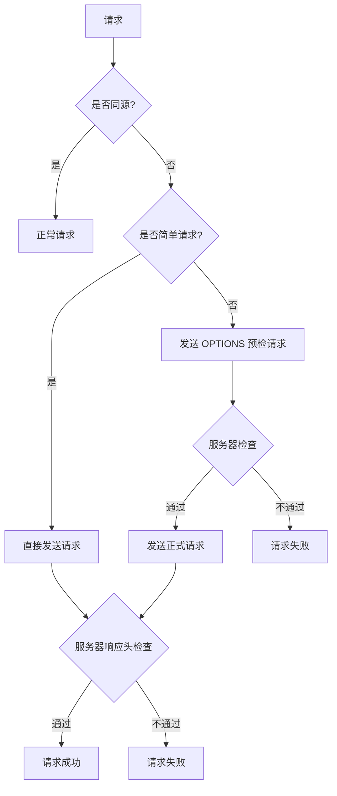

## 0x00 引言

CORS 全称是跨域资源共享（Cross-Origin Resource Sharing），是一种安全机制，用于限制哪些源（origin）可以访问服务器上的资源，这里探讨下该如何正确的设置 CORS。

<!-- more -->

### TLDR

关键配置要点：

- `Access-Control-Allow-Origin`: 禁止使用 `*`，应该设置为具体的白名单域名
- `Access-Control-Allow-Methods`: 明确指定允许的 HTTP 方法
- `Access-Control-Allow-Headers`: 明确指定允许的请求头
- `Access-Control-Allow-Credentials`: 如需携带认证信息，必须设置为 `true`

## 0x01 跨域触发条件



**注：简单请求的定义：**

1. 请求方法为 GET、POST 或 HEAD
2. 请求头只包含安全的字段（Accept、Accept-Language、Content-Language、Content-Type等）
3. Content-Type 只限于：application/x-www-form-urlencoded、multipart/form-data、text/plain

这里只选取了部分内容，更多内容请参考 [MDN 文档](https://developer.mozilla.org/zh-CN/docs/Web/HTTP/CORS)

## 0x02 CORS 规范

当为**非同源**且**非简单请求**时会触发 `preflight` 检查，浏览器会先发出一个 `OPTIONS` 请求，用于检查服务器是否支持该请求，其请求头信息和正式请求一致，但不会携带Body。

🚨 重要提示: 为什么特别强调非简单请求？当浏览器认为这个请求为简单请求时，不会通过两次请求进行检查，也就是没有 `OPTIONS` preflight 请求，是直接发送正式请求，然后根据正式请求的返回头判定是否跨域决定脚本是否可以读取返回内容。

因此也带来一个问题，虽然前端读取不到服务器返回的信息，但请求是真实发出去服务器执行了的，如果服务器没有正确的跨域处理中间件则会导致安全问题。

**Example:**

```text
OPTIONS /api/v1/user HTTP/1.1
Origin: http://hacker.com
Sec-Fetch-Dest: empty
Sec-Fetch-Site: cross-site
Sec-Fetch-Mode: cors
```

服务器在收到 `OPTIONS` 请求后，需要根据配置进行检查，如果允许则返回以下信息：

```text
HTTP/1.1 200 OK
Access-Control-Allow-Origin: http://hacker.com
Access-Control-Allow-Methods: GET, POST, PUT, DELETE
Access-Control-Allow-Headers: Content-Type, Authorization
```

## 0x03 设置建议

### Origins

创建一个中间件，在处理器处理之前检查 `Origin` 和 `Method`，首先判断 `Origin` 是否在白名单内，如果在白名单允许范围内再检查 `Method`，如果是 `OPTIONS` 请求则直接返回 `204 No Content`，否则进入下一步继续处理请求。

### Methods

可以设置为 `*`，如果需要限制则设置为白名单。

### Headers

可以设置为 `*`，推荐限制则设置为白名单。注意，在 `Authorization` 标头不能被泛化处理，始终需要明确列出。如果服务器还提供视频服务且为白名单策略时需要添加一个 `Range` 头。

### Credentials

如果设置为 `true`，则允许浏览器在跨域请求中携带 `Cookie` 信息，但同时 `Access-Control-Allow-Origin` 不能设置为 `*` 必须明确指出具体域名，如果设置为 `*` 会无效。

### Expose-Headers

无所谓，可以不指定，如果浏览器需要访问未在 `Access-Control-Allow-Headers` 中列出的头可以通过设置这个头来解决。

## 0x04 示例代码

```javascript
const allowedOrigins = ['https://example.com', 'https://api.example.com'];

app.use((req, res, next) => {
  const origin = req.headers.origin;
  if (allowedOrigins.includes(origin)) {
    res.setHeader('Access-Control-Allow-Origin', origin);
    res.setHeader('Access-Control-Allow-Methods', 'GET, POST, PUT, DELETE, OPTIONS');
    res.setHeader('Access-Control-Allow-Headers', 'Content-Type, Authorization');
    res.setHeader('Access-Control-Allow-Credentials', 'true');
  }
  
  if (req.method === 'OPTIONS') {
    return res.sendStatus(204);
  }
  
  next();
});
```

特别注意：

1. 预检请求的缓存：可通过 `Access-Control-Max-Age` 设置预检请求的缓存时间，避免重复发送
2. 错误处理：当 CORS 检查失败时，浏览器会在控制台输出详细的错误信息，但实际的网络请求响应会被浏览器拦截，JavaScript 无法访问具体的错误信息
