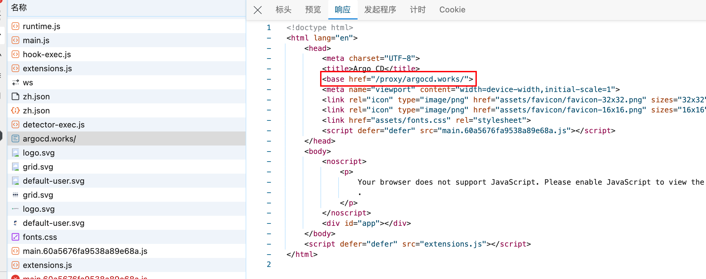
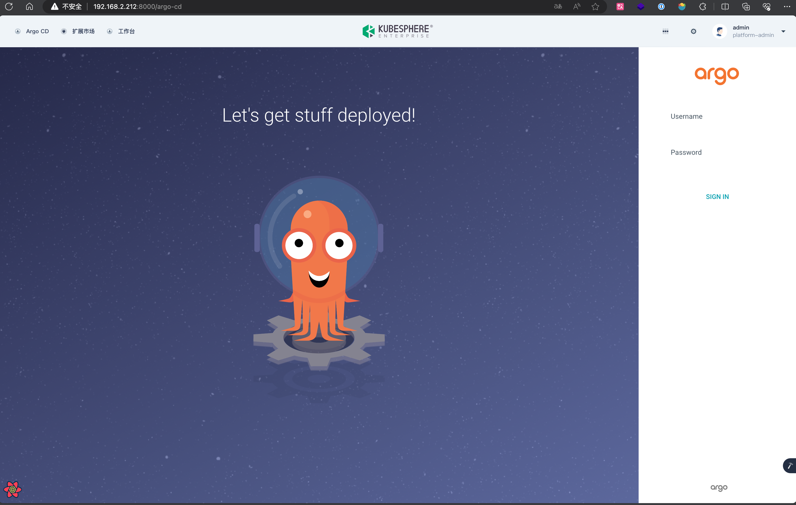
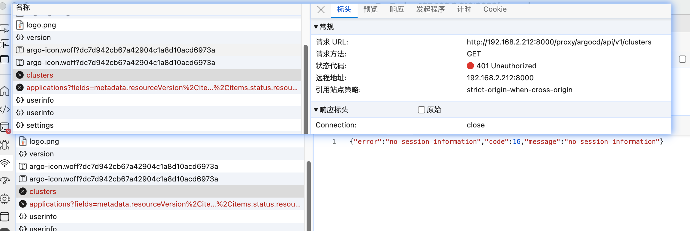
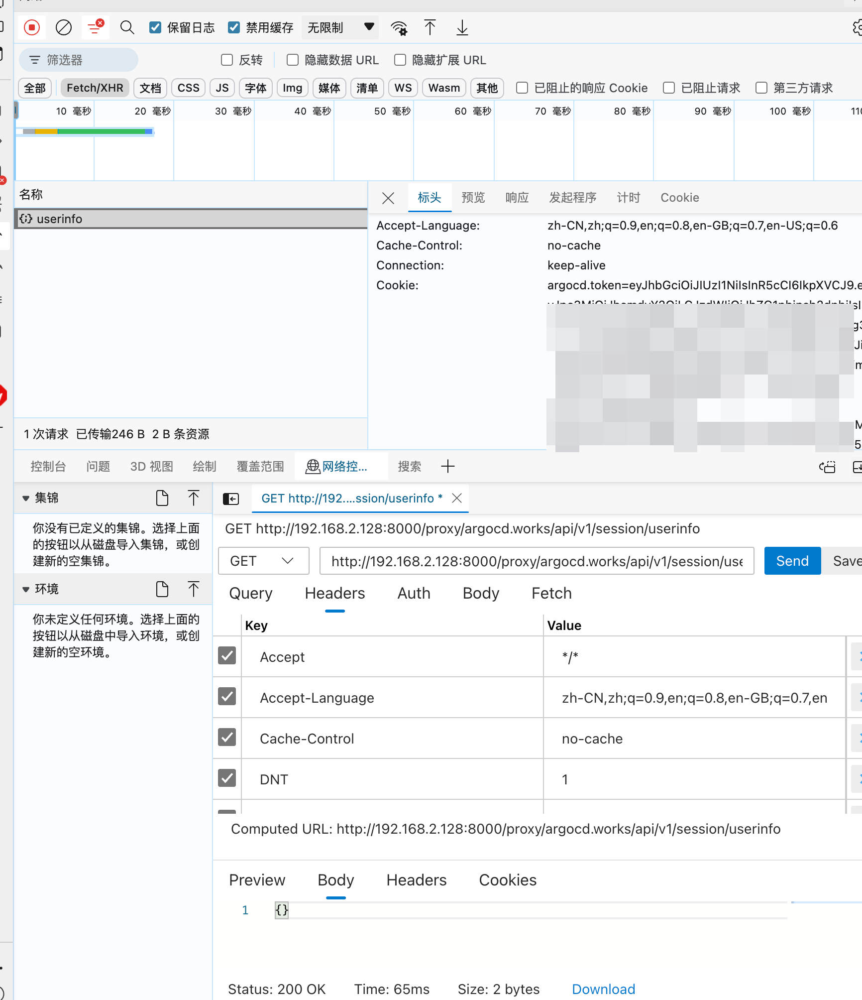
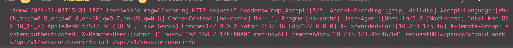
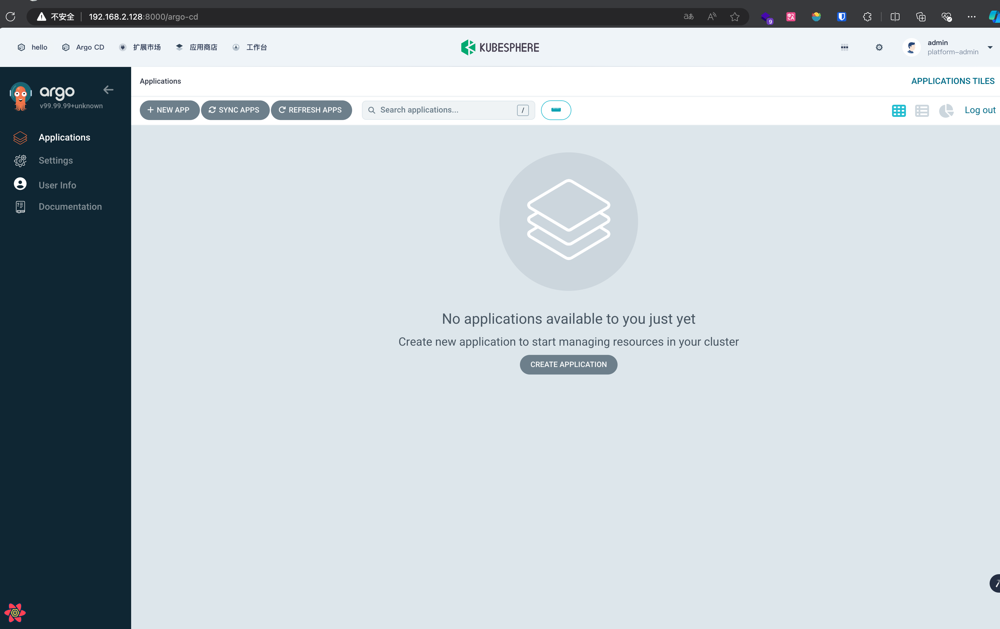

前段时间参加了云原生 Meetup 杭州站活动，正好在这次活动上了解到了 KubeSphere 正在开展扩展组件开发训练营于是报名了这个活动，记录下学习过程。

<!-- more -->

## 0x00 说明

资料来源:

- [KubeSphere 扩展组件开发指南](https://dev-guide.kubesphere.io/extension-dev-guide/zh/)

## 0x01 开发环境搭建

开发需要一个 ks 集群，可以使用 KubeSphere 官方提供的ks-dev环境，也可以自己搭建一个 ks 集群。

### 使用ks-dev环境

<https://kubesphere.cloud/sign-up/?ref=REAwGESiNA> 可以在这里注册一个账号，然后在控制台创建一个 ks 集群。

官方每个月会赠送 10h 的免费使用时间，可以用来开发测试。

### 本地安装

`Node` 使用 `nvm` 安装

```bash
wget -qO- https://raw.githubusercontent.com/nvm-sh/nvm/v0.39.7/install.sh | bash
source ~/.bashrc
nvm install 18
```

安装 `yarn`

```bash
npm install --global yarn
```

安装 `helm`

这里官方提供了文件和脚本两种安装方式，因为是专门为了开发扩展组件开的环境所以为了省事直接脚本安装

<https://helm.sh/docs/intro/install/>

```bash
curl https://raw.githubusercontent.com/helm/helm/main/scripts/get-helm-3 | bash
```

安装 `kubectl`

```bash
curl -LO "https://dl.k8s.io/release/$(curl -L -s https://dl.k8s.io/release/stable.txt)/bin/linux/amd64/kubectl"
sudo chmod +x kubectl 
sudo mv kubectl /usr/local/bin
```

安装完成以后去 `ks` 面板下载 `kubeconfig` 文件放到 `~/.kube/config` 目录下

安装 `ksbuilder

```bash
wget https://github.com/kubesphere/ksbuilder/releases/download/v0.3.13/ksbuilder_0.3.13_linux_amd64.tar.gz
tar -zxf ksbuilder_0.3.13_linux_amd64.tar.gz
sudo mv ksbuilder /usr/local/bin
```

检查安装版本

```bash
sonui@server:~$ ksbuilder --version
ksbuilder version 0.3.13
sonui@server:~$ node --version
v18.20.2
sonui@server:~$ yarn --version
1.22.22
sonui@server:~$ helm version
version.BuildInfo{Version:"v3.14.4", GitCommit:"81c902a123462fd4052bc5e9aa9c513c4c8fc142", GitTreeState:"clean", GoVersion:"go1.21.9"}
sonui@server:~$ kubectl version
Client Version: v1.30.0
Kustomize Version: v5.0.4-0.20230601165947-6ce0bf390ce3
sonui@server:~$ kubectl get node
NAME   STATUS   ROLES                         AGE   VERSION
ks     Ready    control-plane,master,worker   15d   v1.23.10
sonui@server:~$ kubectl -n kubesphere-system get po
NAME                                     READY   STATUS    RESTARTS        AGE
ks-apiserver-754d47ffcc-fx5fz            1/1     Running   2 (6d21h ago)   15d
ks-console-54958f4674-8s225              1/1     Running   2 (6d21h ago)   15d
ks-controller-manager-59d55bc77b-vgnl7   1/1     Running   2 (6d21h ago)   15d
```

### 编写 `ks-apiserver` 反向代理

参考官方示例

<https://raw.githubusercontent.com/kubesphere/extension-samples/master/extensions-backend/weave-scope/weave-scope-reverse-proxy.yaml>

修改为 argocd

```yaml
apiVersion: extensions.kubesphere.io/v1alpha1
kind: ReverseProxy
metadata:
  name: argocd-scope
spec:
  matcher:
    method: '*'
    path: /proxy/argocd.works/*
  upstream:
    url: http://argocd-server.argocd.svc/proxy/argocd.works/
    # url: http://192.168.2.128:8080/proxy/argocd.works/ # 后面调试用到的
  directives:
    authProxy: true
    headerUp:
    - '-Authorization'
status:
  state: Available

```

其中 `upstream.url` 为 argocd 的服务地址

`http://[service name].[namespace].svc`

### 部署 `ArgoCD`

部署 `ArgoCD` 时需要修改下部署参数

首先创建一个 `kustomization.yaml` 文件

```yaml
apiVersion: kustomize.config.k8s.io/v1beta1
kind: Kustomization
namespace: argocd
resources:
- github.com/argoproj/argo-cd/manifests/cluster-install?ref=v2.10.0 # 使用稳定版本

# 配置patches来修改argocd-server的配置
patches:
- path: argocd-server-config-patch.yaml
  target:
    kind: ConfigMap
    name: argocd-cmd-params-cm

```

argocd-server-config-patch.yaml:

```yaml
apiVersion: v1
kind: ConfigMap
metadata:
  name: argocd-cmd-params-cm
  namespace: argocd
data:
  # 设置UI Base Path
  server.basehref: "/proxy/argocd.works/"  # 注意结尾的斜杠
  server.insecure: "true"      # 禁用 TLS
  server.rootpath: "/proxy/argocd.works"

```

`basehref` 配置说明


> If the Argo CD UI is available under a non-root path (e.g. /argo-cd instead of /) then the UI path should be configured in the API server. To configure the UI path add the --basehref flag into the argocd-server deployment command
> <https://argo-cd.readthedocs.io/en/stable/operator-manual/ingress/#ui-base-path>

然后执行 `kubectl apply -k .` 重新部署 `ArgoCD`

如果这个配置没有生效可以执行 `kubectl rollout restart deployment argocd-server -n argocd` 重启下服务使更改生效

### 设置前端反向代理

插件设置下 `webpack.config.js`，如果不设置的话在浏览器中访问 `ArgoCD` 面板会提示404错误

`ks-console/configs/webpack.config.js`

```js
const { merge } = require('webpack-merge');
const baseConfig = require('@ks-console/bootstrap/webpack/webpack.dev.conf');

const webpackDevConfig = merge(baseConfig, {
  devServer: {
    proxy: {
      '/proxy': {
        target: 'http://192.168.2.128:30880', // 修改为目标 ks-apiserver 的地址
        onProxyReq: (proxyReq, req, res) => {
            const username = 'admin'        // 请求代理时的用户凭证
            const password = 'P@88w0rd'
            const auth = Buffer.from(`${username}:${password}`).toString("base64");
            proxyReq.setHeader('Authorization', `Basic ${auth}`);
          },
      },
    },
  },
});

module.exports = webpackDevConfig;

```

设置好以后需要重启下 `yarn dev` 使更改生效

## 0x02 调试

全部完成后访问控制面板可以看到弹出 `ArgoCD` 登录界面



按照文档说明尝试登录出现进入面板后又回到登录界面的问题，F12 查看有接口返回 401 错误，猜测可能是传递给 `ArgoCD` 服务的这两个请求没有认证信息



根据官方[调试教程](https://argo-cd.readthedocs.io/en/stable/developer-guide/debugging-remote-environment/#install-argocd)本地起了一个 `ArgoCD` 服务，然后修改 `ReverseProxy` 的 `upstream.url` 为本地 `ArgoCD` 服务地址

对官方文档中的 `vscode` 调试配置做了下修改

```json
{
    "version": "0.2.0",
    "configurations": [
        {
            "name": "Debug ArgoCD Server",
            "type": "go",
            "request": "launch",
            "mode": "auto",
            "program": "${workspaceFolder}/argo-cd/cmd/main.go",
            "env": {
                "ARGOCD_BINARY_NAME": "argocd-server",
                "CGO_ENABLED": "0",
                "KUBECONFIG": "/home/sonui/.kube/config",
            },
            "envFile": [
                "${workspaceFolder}/.envrc.remote",
            ],
            "args": [
                "--insecure",
                "--rootpath",
                "/proxy/argocd.works/",
                "--basehref",
                "/proxy/argocd.works/"
            ]
        }
    ]
}
```

在 <https://github.com/argoproj/argo-cd/blob/a7637cd106f615119930439d963ec0a9618b404d/server/server.go#L1037> 添加请求头打印

```go
    gwMuxOpts := runtime.WithMarshalerOption(runtime.MIMEWildcard, new(grpc_util.JSONMarshaler))
    gwCookieOpts := runtime.WithForwardResponseOption(a.translateGrpcCookieHeader)
    gwmux := runtime.NewServeMux(gwMuxOpts, gwCookieOpts)

    var handler http.Handler = gwmux
    if a.EnableGZip {
        handler = compressHandler(handler)
    }
    if len(a.ContentTypes) > 0 {
        handler = enforceContentTypes(handler, a.ContentTypes)
    } else {
        log.WithField(common.SecurityField, common.SecurityHigh).Warnf("Content-Type enforcement is disabled, which may make your API vulnerable to CSRF attacks")
    }

    logMiddleware := func(next http.Handler) http.Handler {
        return http.HandlerFunc(func(w http.ResponseWriter, r *http.Request) {
            // 打印基本请求信息
            log.WithFields(log.Fields{
                "method":     r.Method,
                "url":        r.URL.String(),
                "headers":    r.Header,
                "remoteAddr": r.RemoteAddr,
                "host":       r.Host,
                "requestURI": r.RequestURI,
            }).Info("Incoming HTTP request")

            next.ServeHTTP(w, r)
        })
    }
    handler = logMiddleware(handler)
    mux.Handle("/api/", handler)
```

发起请求



可以在浏览器开发者工具中看到请求头中有 `Cookie` 信息，而 `ArgoCD` 打印的日志没有



如果在上面的日志代码中手动写死一个 `Cookie` 信息再请求能看到接口返回正常，确定是反向代理的问题，待联系ks技术问问，这里先写死继续后续开发

刷新页面提示 `open dist/app/index.html: file does not exist` 错误，添加下启动配置

进入 `ArgoCD` 代码目录下的 `ui` 目录，执行 `build` 命令生成 `dist` 目录，拷贝出来绝对地址填入下面的位置

```js
          "args": [
                // ... 其它配置
                "--staticassets",
                "/path/to/argo-cd"
          ]
```

重启 `ArgoCD` 服务，刷新浏览器页面可以看到正常进入 `ArgoCD` 面板



待解决 `Cookie` 问题后再对接 `OAuth` 认证
[OAuth 对接文档](https://dev-guide.kubesphere.io/extension-dev-guide/zh/best-practice/develop-example/#oauth-对接)
