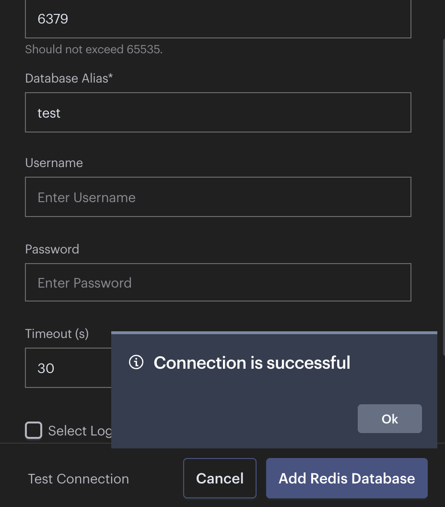

在使用 `Docker` 容器时我们经常需要将容器端口映射到宿主机上。最基本的端口映射可以通过 "PORT:PORT" 来设置，比如 "6379:6379" 就是将容器的 `6379` 端口映射到宿主机的 `6379` 端口上。

然而，这种基本的端口映射存在一个主要问题：默认情况下，任何能访问到宿主机的客户端都可以访问这个端口。在生产环境中我们通常需要限制只允许特定的 IP 地址或网段访问容器端口。

<!-- more -->

## 0x00 Docker 网络工作原理

当我们映射容器端口时，`Docker` 会在 `iptables` 中添加相关规则。数据包的流向如下：


为了限制访问我们需要在 `DOCKER-USER` 链中添加规则来控制流量。`DOCKER-USER` 链中的规则会在 `DOCKER` 链中的规则之前执行，具体文档可以查看 [Packet filtering and firewalls](https://docs.docker.com/engine/network/packet-filtering-firewalls/)

## 0x01 配置示例

首先创建一个测试用的 Redis 容器：

```yaml
services:
  redis:
    image: redis:latest
    restart: unless-stopped
    ports:
      - 6379:6379
    volumes:
      - /etc/localtime:/etc/localtime:ro
```

测试下可访问性

机器1 (IP: 192.168.1.10):


机器2 (IP: 192.168.2.10):


### 添加访问控制规则

以下规则将只允许来自机器1网段访问 6379 端口:

```shell
# 允许已建立的连接
sudo iptables -I DOCKER-USER -m state --state ESTABLISHED,RELATED -j ACCEPT

# 允许指定网段访问指定端口
sudo iptables -I DOCKER-USER -i eth0 -p tcp -s 192.168.1.0/24 --dport 6379 -j ACCEPT

# 允许 docker0 网桥转发到指定端口的流量
sudo iptables -I DOCKER-USER -i docker0 -p tcp --dport 6379 -j ACCEPT
sudo iptables -I DOCKER-USER -o docker0 -p tcp --dport 6379 -j ACCEPT

# 拒绝其他所有访问该端口的请求
sudo iptables -A DOCKER-USER -p tcp --dport 6379 -j DROP

# 允许其他端口的流量（可选）
sudo iptables -A DOCKER-USER -j RETURN
```

### 多端口配置示例

如果需要限制多个端口，可以使用多端口匹配：

```shell
# 允许访问多个端口
sudo iptables -I DOCKER-USER -i eth0 -p tcp -s 192.168.1.0/24 -m multiport --dports 6379,8080,3306 -j ACCEPT

# 允许 docker0 网桥转发多个端口
sudo iptables -I DOCKER-USER -i docker0 -p tcp -m multiport --dports 6379,8080,3306 -j ACCEPT
sudo iptables -I DOCKER-USER -o docker0 -p tcp -m multiport --dports 6379,8080,3306 -j ACCEPT

# 拒绝其他所有访问这些端口的请求
sudo iptables -A DOCKER-USER -p tcp -m multiport --dports 6379,8080,3306 -j DROP
```

### 验证规则

检查规则是否正确配置：

```shell
# 查看规则列表
➜  sudo iptables -L DOCKER-USER -n -v --line-numbers
Chain DOCKER-USER (1 references)
num   pkts bytes target     prot opt in     out     source               destination         
1        0     0 ACCEPT     tcp  --  *      docker0  0.0.0.0/0            0.0.0.0/0            tcp dpt:6379
2        0     0 ACCEPT     tcp  --  docker0 *       0.0.0.0/0            0.0.0.0/0            tcp dpt:6379
3       28  1478 ACCEPT     tcp  --  eth0   *       192.168.1.0/24       0.0.0.0/0            tcp dpt:6379
4        9   540 DROP       tcp  --  *      *       0.0.0.0/0            0.0.0.0/0            tcp dpt:6379
5       21  1107 RETURN     all  --  *      *       0.0.0.0/0            0.0.0.0/0
```

机器1 (IP: 192.168.1.10):


机器2 (IP: 192.168.2.10):


## 0x02 持久化规则

为了重启后规则不会丢失，需要保存下设置好的 `iptables` 规则：

```shell
# Ubuntu/Debian 系统
sudo netfilter-persistent save

# CentOS/RHEL 系统
sudo service iptables save
```

## 0x03 清理规则

如果需要删除规则，可以使用以下命令：

```shell
# 清除 DOCKER-USER 链中的所有规则
sudo iptables -F DOCKER-USER

# 恢复默认规则（允许所有流量）
sudo iptables -A DOCKER-USER -j RETURN
```

## 0x04 注意事项

1. 确保规则顺序正确，ACCEPT 规则必须在 DROP 规则之前
2. 添加规则时要考虑到容器间的通信需求
3. 如果使用自定义 Docker 网络，需要相应调整网桥接口名称
4. 建议在生产环境部署前充分测试规则的有效性
