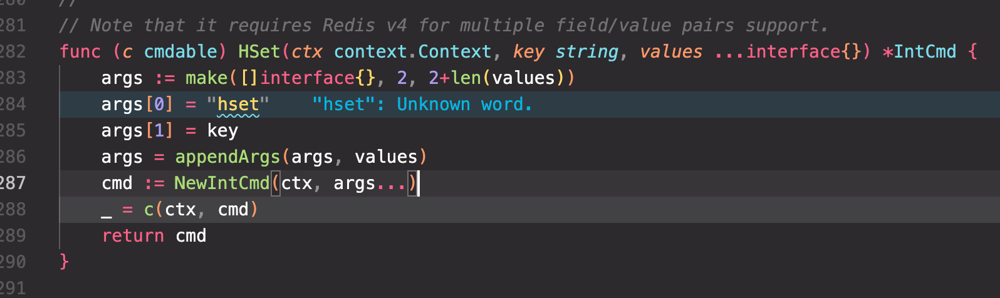
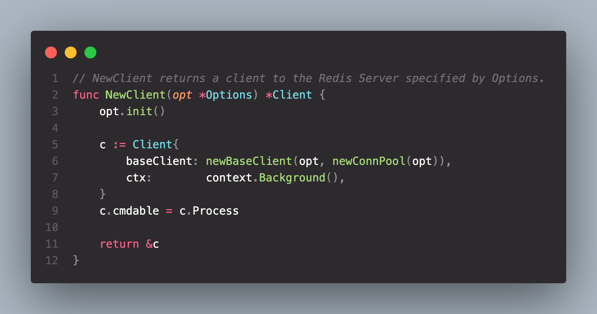
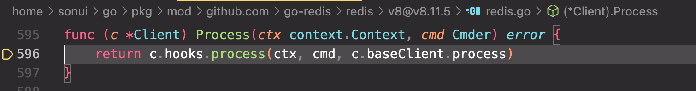
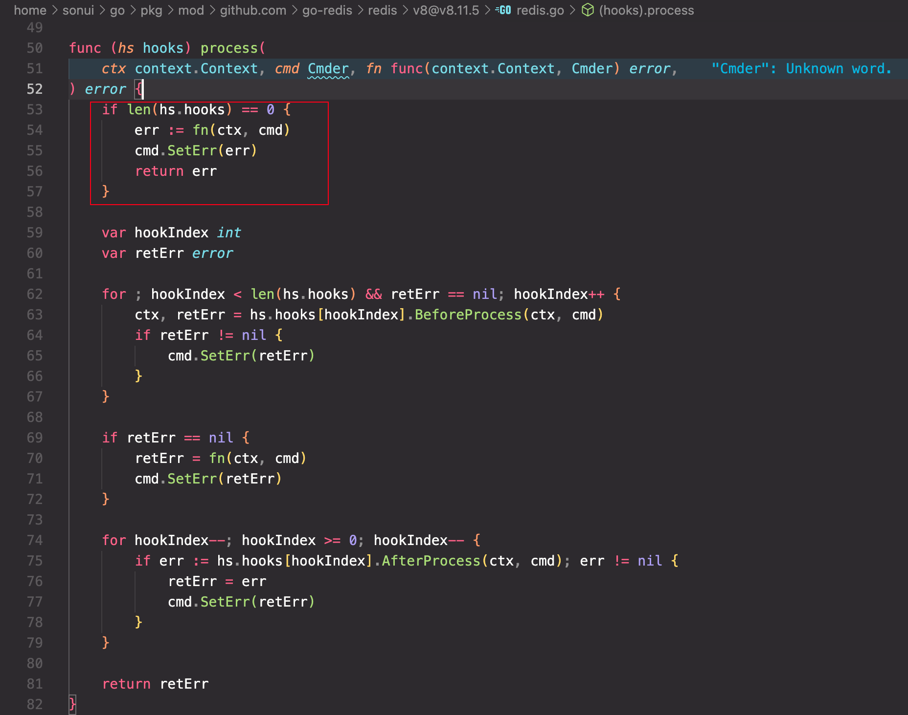
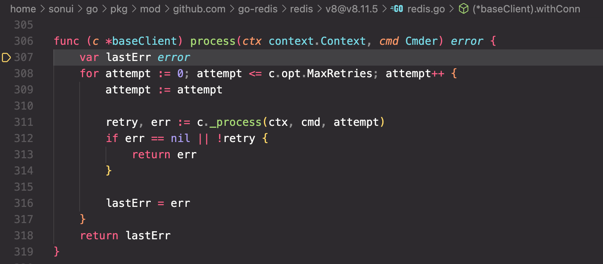
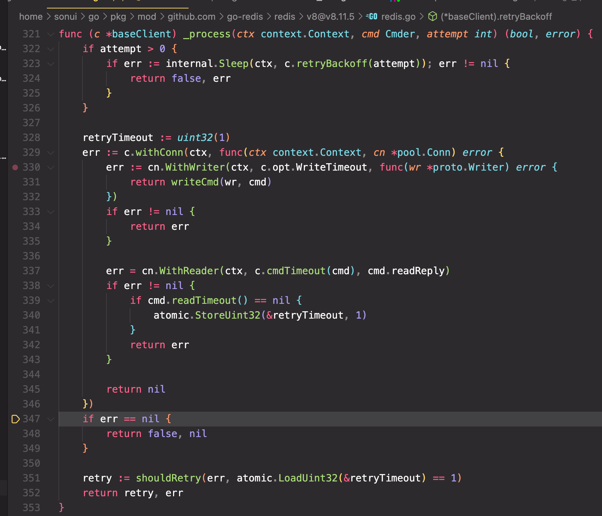
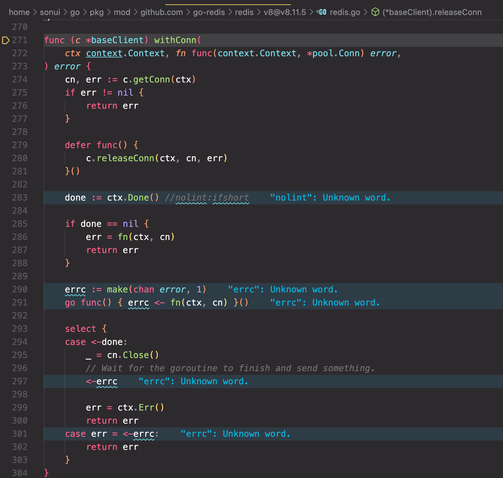
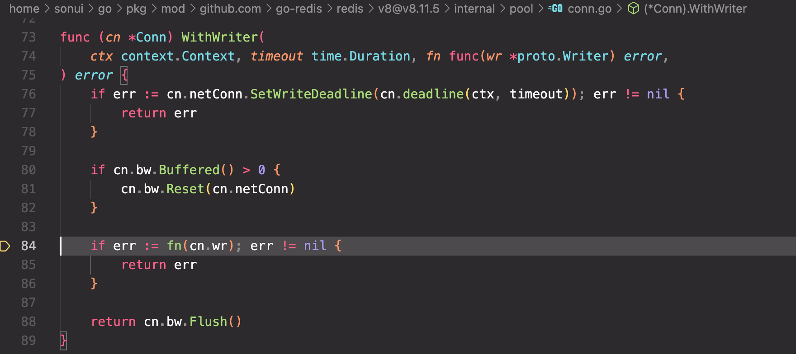
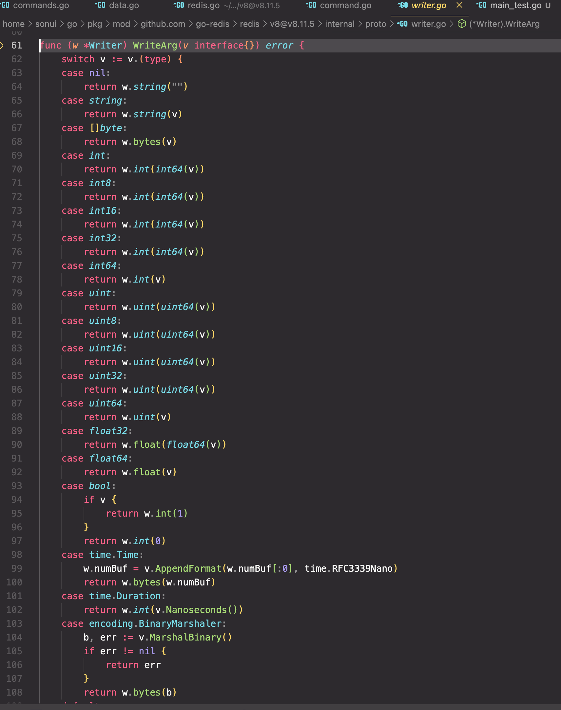
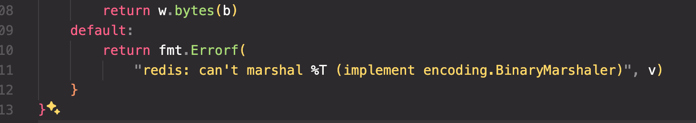

`go-redis` 库对于 `HSet` 方法支持的数据类型为 `interface{}`，查看下支持哪些类型的。

## Version

> github.com/go-redis/redis/v8 v8.11.5
>
> <https://pkg.go.dev/github.com/go-redis/redis/v8@v8.11.5#Client.HSet>

## Code

```go
type Son struct {
    A int
    B string
}

type Person struct {
    Name string
    Age  int
    Son  []Son
}

func TestSerialize(t *testing.T) {
    redis := redis.NewClient(&redis.Options{
        Addr: "localhost:6379",
    })

    data := Person{
        Name: "zhangsan",
        Age:  18,
        Son: []Son{
            {
                A: 1,
                B: "a",
            },
            {
                A: 2,
                B: "b",
            },
        },
    }

    redis.HSet(context.Background(), "person", "name", data)
}
```

## Debug

可以通过跳转看到函数内部实现如下



`appendArgs` 函数将 `args` 追加到 `values` 参数的前面后生成一个 `IntCmd` 对象，传递给 `c` 进行处理（`c` 的定义可以在 `NewClient` 函数中看到其为 `Client` 对象）



通过调试追踪可以确认 `c` 为 `Client` 对象，`c` 的 `Process` 方法会将 `IntCmd` 对象传递给 `Process` 方法进行处理



继续查看 `process` 方法的实现，可以看到跳到了这里



由于没有设置 `hook` 所以直接进入 `c.baseClient.process` 方法执行



这部分进行重复尝试，进入 `c._process` 方法查看代码



忽略头部的睡眠代码，直接下面

`c.withConn` 传递了一个匿名函数，在方法中获取到一个 `conn` 对象，然后调用该函数



在 `withConn` 通过传递过来的 `fn` 函数对数据进行序列化处理



序列化的具体实现可以发现是调用 `writeCmd` 方法，进入该方法一路跳转可以看到具体的执行代码



最终兜底处理



## Summary

`go-redis` 库对于 `HSet` 方法支持的数据类型为 `interface{}`，在传递数据时会调用 `writeCmd` 方法进行序列化处理，最终通过 `conn` 对象将数据传递给 `redis` 服务端

支持的数据类型基本为基础数据类型，如果是自定义的结构体需要自己实现序列化和反序列化的方式
