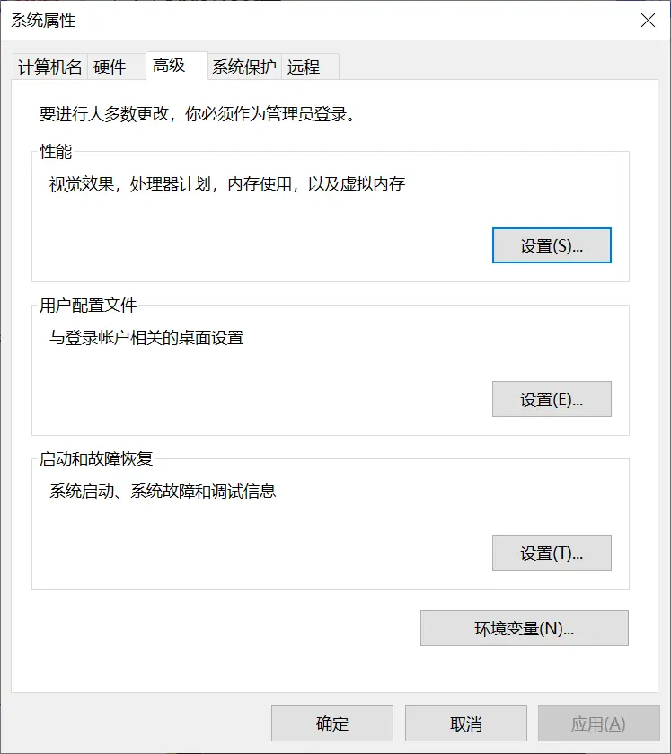
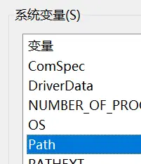
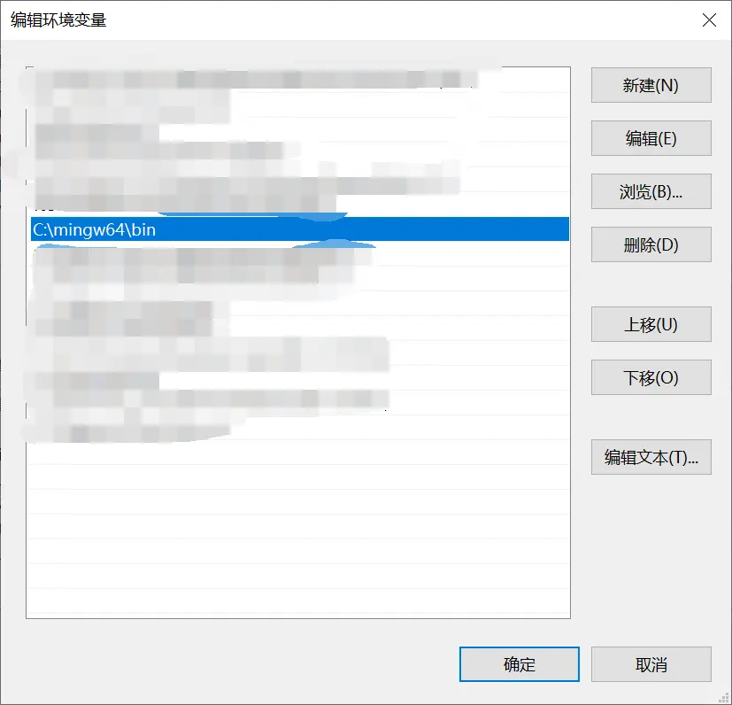
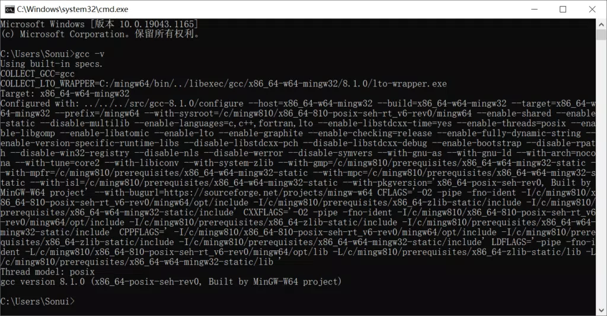
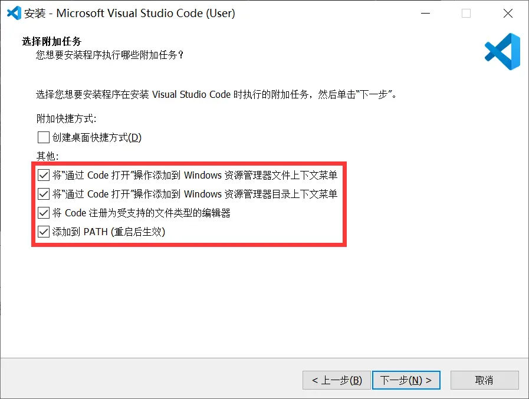
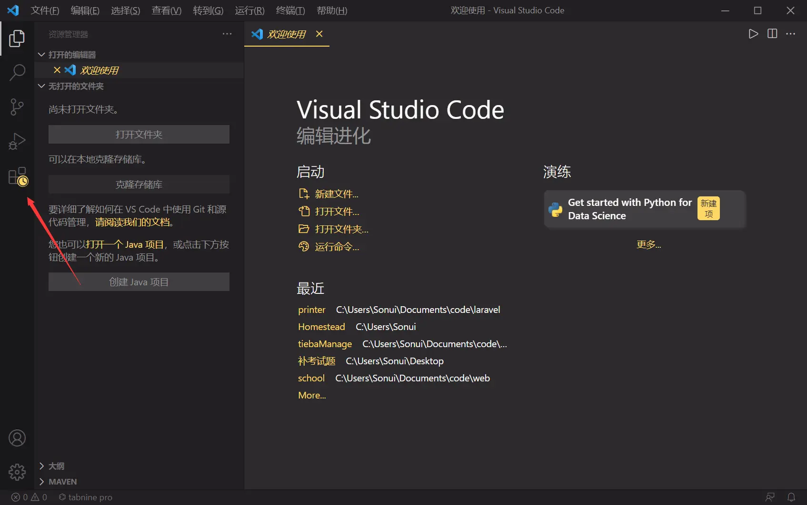
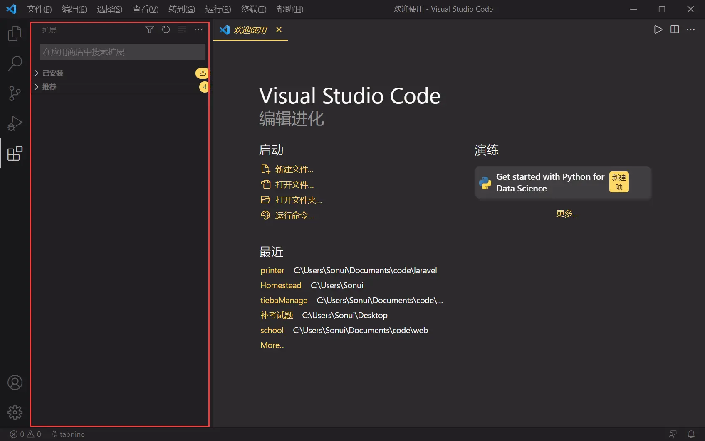
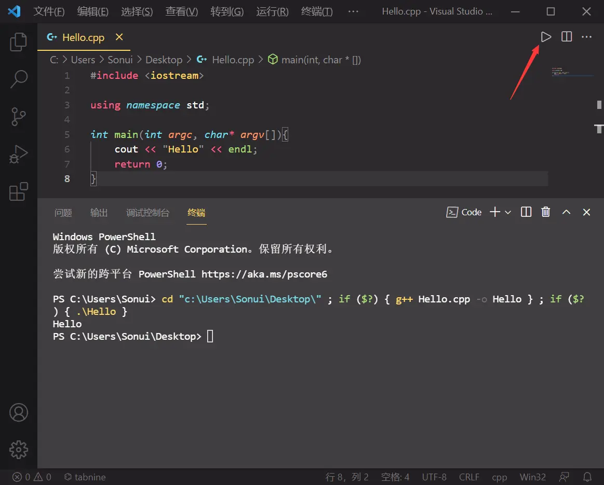

VS Code C/C++ 环境配置教程

## Windows

### 预备文件

#### MinGW-W64

- [国内下载](https://wwa.lanzoui.com/ioHt0suhtva)
- [国外下载](https://sourceforge.net/projects/mingw-w64/files/)

#### Visual Studio Code

[官网下载](https://code.visualstudio.com/)

#### 推荐插件

在 VS Code 扩展商店搜索安装：[Code Runner](https://marketplace.visualstudio.com/items?itemName=formulahendry.code-runner)、[C/C++](https://marketplace.visualstudio.com/items?itemName=ms-vscode.cpptools)

### 配置编译器

将 MinGW-W64 解压后，复制其路径，例如解压到了 C 盘，路径为 `C:\mingw64\`

按下 `Win+R` 输入 `sysdm.cpl` 打开系统属性窗口，切换到高级选项，点击右下方环境变量

双击系统变量中的 Path 项目

在弹出的窗口中点击右边的新建按钮，粘贴之前复制的目录，后面加上 bin，例如 `C:\mingw64\bin`，最终如图

按下 `Win+R` 输入 `cmd`，在 `cmd` 窗口中输入 `gcc -v` 出现关于编译器相关信息即可，如果提示找不到可以尝试重启电脑后再运行命令

### 安装 VS Code

下载 `VSCodeUserSetup-x64.exe` 文件后，双击打开，选择 `我同意此协议`

根据自己需要勾选，也可以按照图中所示的勾选

将之前下载的 `插件.zip` 文件解压到桌面，然后启动 VS Code，切到图中所指标签

然后将之前解压的三个文件选中，拖放到图中画框区域进行安装

然后点击 `文件` → `首选项` → `设置` 找到列表中的 `扩展` 点开，寻找 `Run Code config`

寻找 Run In Terminal 勾选

最后选择一个 Hello World 源码文件右键选择 VS Code 打开，点击右上角三角图标运行，运行如图所示就说明环境 ok 可以使用了

