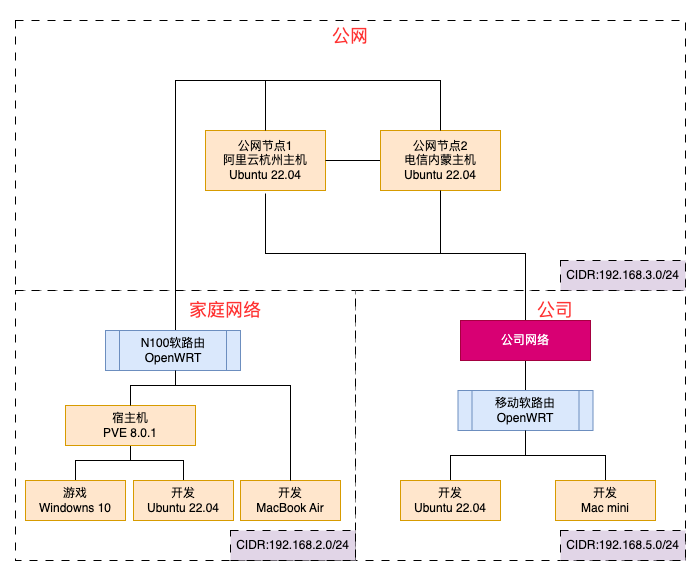
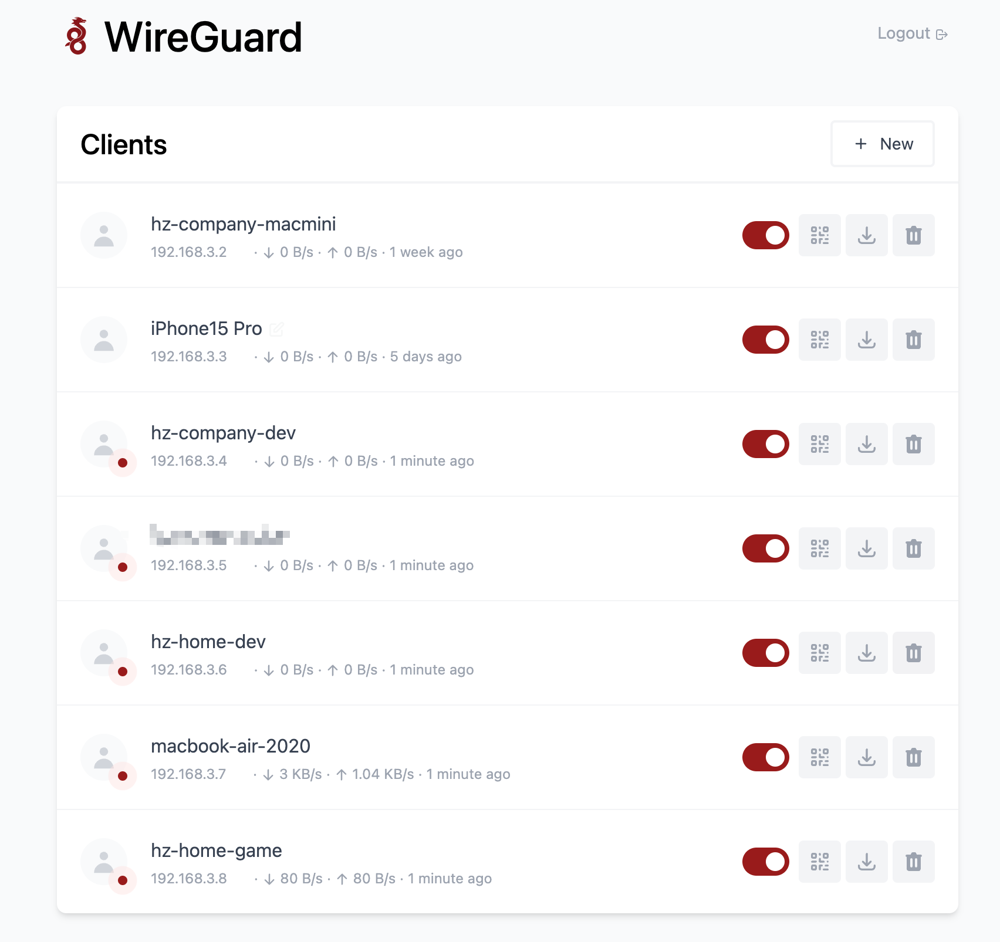
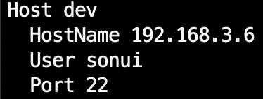
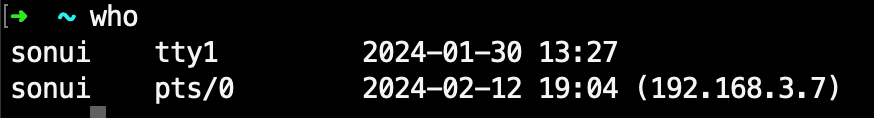

由于家庭和公司各存在一套开发环境，同时外出时需要能够连接至某台服务器上进行工作，所以需要一个组网的方案，考虑到安全性及性能选择了 WireGuard。

## 说明

### 家庭网络

家庭网络中有一个 PVE 服务器，开启了两个虚拟机分别是 Windows 10 和 Ubuntu 22.04；Windows 10 通过将显卡直通进去，用于游戏娱乐；Ubuntu 22.04 作为开发机。由于手头的 mac 设备内存不够，所以所有环境都是通过 VS Code Remote SSH 到开发机上进行工作。

### 公司网络

公司网络通过一个独立路由器创建出来一个子网，实体机安装了 Ubuntu 22.04 作为开发机，同样通过 VS Code Remote SSH 到开发机上进行工作。

### 网络拓扑



## 搭建 WireGuard

为了方便管理，使用了 `wg-easy` 这个工具，具体的安装和使用可以参考 [wg-easy](https://github.com/wg-easy/wg-easy)。

CIDR 选择了 `192.168.3.0/24`

`compose.yaml`

```yaml
version: "3.8"

services:
  wg-easy:
    environment:
      - WG_HOST=x.x.x.x
      - PASSWORD=xxxx
      - WG_PERSISTENT_KEEPALIVE=15
      - WG_MTU=1420
      - WG_DEFAULT_ADDRESS=192.168.3.x
      - WG_ALLOWED_IPS=192.168.3.0/24
    image: myHarbor/sonui/wg-easy
    container_name: wg-easy
    hostname: wg-easy
    volumes:
      - ./data:/etc/wireguard
    ports:
      - "51820:51820/udp"
      - "127.0.0.1:51821:51821"
    restart: unless-stopped
    cap_add:
      - NET_ADMIN
      - SYS_MODULE
    sysctls:
      - net.ipv4.ip_forward=1
      - net.ipv4.conf.all.src_valid_mark=1
```

- 注：如果选择 Podman 作为容器运行时会出现无法连通的问题，猜测需要配置网络

## 测试

对各设备分配固定 IP 及配置启动后控制面板如下：



在 MacBook 上配置好 SSH config：



`ssh dev` 连接到家庭网络的开发机，查看 session 信息：



连接成功，可以看到 IP 地址是 `192.168.3.7`，说明 wg 组网成功。
